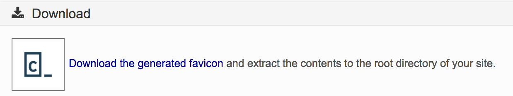
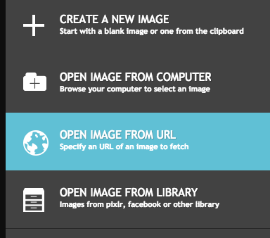

##### Link to Codecademy lesson

https://www.codecademy.com/paths/learn-how-to-build-websites/tracks/finishing-touches-and-publishing-a-website/modules/finishing-touches/articles/f1-u7a1-managing-assets


###### This is the README.md file for this project.  It taken from the following link at Codecademy.

https://www.codecademy.com/paths/learn-how-to-build-websites/tracks/finishing-touches-and-publishing-a-website/modules/finishing-touches/articles/f1-u7a1-managing-assets

# Managing Assets and Icons

### Create favicons, Crop and Resize Images, and Convert Between File Types

In this article, you will learn how to manage icons and assets using web-based tools.

## Introduction

An important part of building an attractive web page is including visual assets such as logos and images. One way to make a web page more professional is to add something called a favicon - a small image displayed in the tab or browser >

You may also need to resize or crop images before adding them to a web page. You’ll get to try all of this below!


1. JPEG - a highly compressible file type that is preferred for images with significant detail

2. PNG - a file type that is lossless (meaning that full quality is maintained) - generally preferred for images with less detail such as logos

3. SVG - useful for high resolution screens, scalable vector graphics (SVG) will change size (scale) for various screen sizes; SVGs also contain roughly 50% less data than their JPEG or PNG equivalents allowing web pages to load more quickly; they are becoming widely used for simple images such as icons and logos


### Making favicons using favicon-generator.org

A favicon is frequently the same as, or a modified version of, whatever logo is associated with a company’s web page.

To convert an existing image to a favicon, you can use an online conversion tool such as Favicon-Generator.


## ** Exercise I: Create a favicon from an existing image **

1. The image being used must be a GIF, PNG, or JPEG (you may find JPG and JPEG used interchangeably). For this exercise, we will provide an image. Open this image in a new tab. Right click or Ctrl and click on the image and download it to your local machine.

2. On favicon-generator.org, click “Choose File.” Select the file you just downloaded.

3. Select “Generate Only 16x16 favicon.ico.”


4. We recommend that you unselect “Maintain Image Dimensions” so that the image will be resized to a square.

5. Deselect “Include your favicon.ico in the public gallery”.

6. Click “Create Favicon.”


7. Click “Download the generated favicon” and save it locally.



8. To add the favicon to your web page, add the file to your project directory and add this code to the <head> of your HTML document.

```
<link rel="icon" href="./<favicon-name>.ico" type="image/x-icon">
```

That’s it! You have a favicon!

## Editing Images

Another important skill is creating and managing assets. Assets are images and other media that will be presented on your web page.

Sometimes your images will be imperfect for any number of reasons: they might contain content you wish to crop out, the file size may be unnecessarily large, or the image itself might be too big.

A best practice is to ensure that images are sized properly before adding them to an HTML file. Images that are too large may overflow their parent container or render incorrectly. Furthermore, overly large files cause web pages to load significantly slower.

There are several tools we can use to modify assets. Adobe Photoshop is a commonly used and useful tool for all sorts of photo editing tasks. Unfortunately, Photoshop requires a monthly subscription fee. Because of the cost, in this article we will use Pixlr, a free and industry-accepted alternative.

## Exercise 2: Edit and Crop an Image with Pixlr

1. Navigate to Pixlr.

2. Select the correct option based on where your asset is stored. In this case, select “OPEN IMAGE FROM URL.”



3. Paste this image URL into the box that appears. Be sure that you don’t have http twice at the beginning of the URL.


###### NG: memory jog
/c/Users/glads/Downloads/FONT_AWESOME_ICON_SIZING


